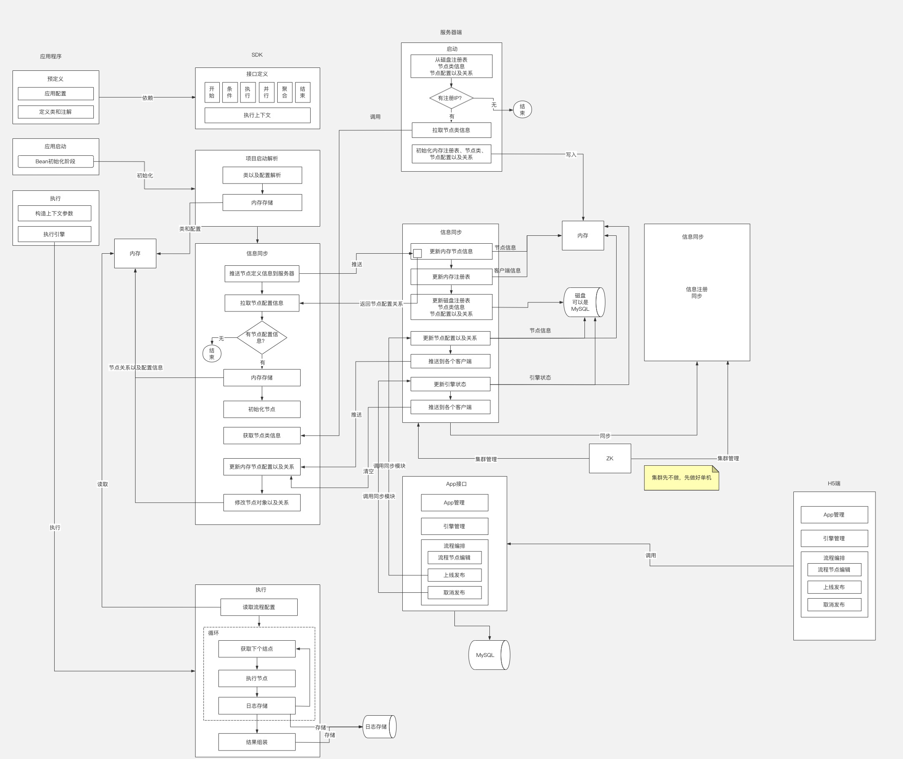
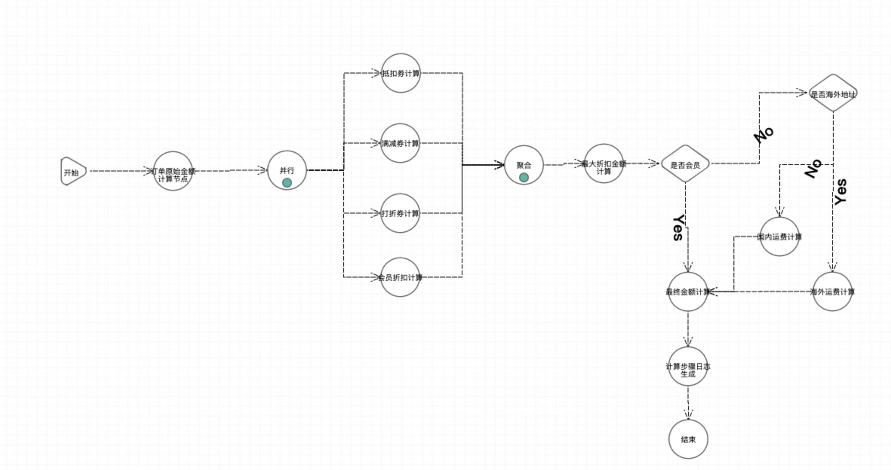

##前言
- - -
FiboRule Lite - 轻量级规则引擎 
* 轻量级 - 会编程即可轻松上手、无需复杂的系统的操作
* 阈值可配置 - 每个流程节点中的变量阈值可通过界面进行配置
* 流程可配置 - 逻辑编排可通过拖拉拽节点来实现
* 配置简单化 - 业务场景中，经常变动的是逻辑编排和阈值。核心支持逻辑编排配置和阈值配置
* 场景化 - 各个业务场景提供示例代码，方便上手

###代码结构
* fiborule 后端核心代码  
  `fiborule-common` 通用dto、枚举、model、util类等  
  `fiborule-core` SDK核心代码类  
  `fiborule-server` 服务器端代码  
  `fiborule-spring` 客户端初始化  
  `fiborule-spring-boot-starter` 全景配置参数  
  `fiborule-test` 测试用例  
  `fiborule-test-mall` 场景测试-商城用例  
  `fiborule-test-pay` 场景测试-商城用例
* h5-fiborule-manager 前端核心代码
* document 详细的使用文档

###架构图

高清大图地址：
https://www.processon.com/view/link/63849862e0b34d37c4717942

###Demo图

###开源交流
可加微信号，进开源交流群  
