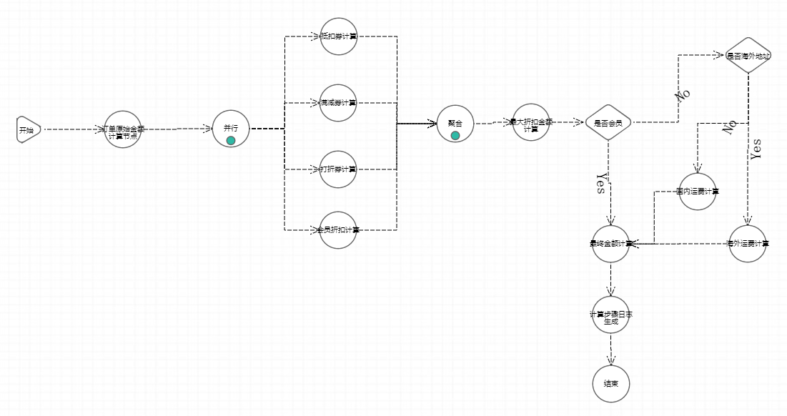

#电商案例
电商案例是一个订单金额计算案例，模拟了电商系统中对订单金额的计算。<br>
fiborule-test-mall模块
* 1、接收订单数据后，先计算出订单原始金额；
* 2、然后按照原始金额计算出抵扣金额、满减金额、打折券金额、会员折扣金额，取四种优惠的最大金额；
* 3、然后按照是否会员和是否海外地址计算出运费；
* 4、最后得出订单的最终金额。

##组件开发
- - -
* OrderInitNode - 订单原始金额计算组件
* CouponDiscountNode - 抵扣券计算组件（抵扣金额支持配置）
* FullDecrementNode - 满减券计算组件（满足金额和减免金额支持配置）
* FullDisCountNode - 打折券计算组件（满足金额和折扣支持配置）
* MemberDisCountNode - 会员折扣计算组件（折扣支持配置）
* DisCountCollectNode - 最大折扣金额计算组件
* MemberJudgeNode - 是否会员组件
* AddressJudgeNode - 是否海外地址组件
* HomeFreightNode - 国内运费计算组件（运费和免运费金额支持配置）
* AbroadFreightNode - 海外运费计算组件（运费支持配置）
* FinalAmountNode - 最终金额计算组件
* AmountStepPrintNode - 计算步骤日志生成组件
* PriceContext - 价格计算上下文
* OrderVo - 订单类，引擎执行参数
* SendService - 通知发送模拟类，Spring应用可以直接注入，非Spring应用请初始化FiboBeanUtils的FiboBeanFactory装配实例

##后台配置
- - -
```Java
fiborule.app=2
fiborule.server=localhost:18121
fiborule.scene-list[0].name=mall-price
fiborule.scene-list[0].path=com.fibo.rule.test.mall
```
##引擎流程图
- - -

##执行结果
- - -
参数-订单信息json
```json
{
  "aboard":false,
  "orderNo":"SO2020070611120001",
  "vip":false,
  "goodsList":[
    {"count":2,"goodsCode":"PD5001XC","goodsId":5001,"goodsPrice":139.00,"skuCode":"SKU5001XC001","skuId":67001441,"skuName":"夏季运动女式短裙M"},
    {"count":3,"goodsCode":"PD6001XC","goodsId":6001,"goodsPrice":59.00,"skuCode":"SKU6001XC001","skuId":67002334,"skuName":"男士迷彩短袜均码"},
    {"count":5,"goodsCode":"PD8001XC","goodsId":8001,"goodsPrice":28.00,"skuCode":"SKU8001XC001","skuId":87002001,"skuName":"纯棉毛巾"},
    {"count":2,"goodsCode":"PD9001XC","goodsId":9001,"goodsPrice":30,"skuCode":"SKU9001XC001","skuId":97552001,"skuName":"杀菌护手凝胶"}
  ]
}
```
执行结果-价格计算上下文json
```json
{
  "aboard":false,
  "amountStepList":[
    {"amountType":"ORIGINAL","currPrice":655,"priceChange":655,"stepDesc":"原始价格"},
    {"amountType":"FULL_DISCOUNT","currPrice":589.5,"prePrice":655,"priceChange":-65.5,"stepDesc":"打折券(满200打9.0折)"},
    {"amountType":"POSTAGE","currPrice":599.5,"prePrice":589.5,"priceChange":10,"stepDesc":"国内运费"},
    {"amountType":"POSTAGE_FREE","currPrice":589.5,"prePrice":599.5,"priceChange":-10,"stepDesc":"运费减免(满99)"}
  ],
  "discountList":[
    {"amountType":"COUPON_DISCOUNT","desc":"抵扣券(减15)","priceChange":-15},
    {"amountType":"FULL_DECREMENT","desc":"满减券(满100减5)","priceChange":-5},
    {"amountType":"FULL_DISCOUNT", "desc":"打折券(满200打9.0折)", "priceChange":-65.5}
  ],
  "finalPrice":589.5,
  "goodesList":[
    {"count":2,"goodsCode":"PD5001XC","goodsId":5001,"goodsPrice":139.00,"skuCode":"SKU5001XC001","skuId":67001441,"skuName":"夏季运动女式短裙M"},
    {"count":3,"goodsCode":"PD6001XC","goodsId":6001,"goodsPrice":59.00,"skuCode":"SKU6001XC001","skuId":67002334,"skuName":"男士迷彩短袜均码"},
    {"count":5,"goodsCode":"PD8001XC","goodsId":8001,"goodsPrice":28.00,"skuCode":"SKU8001XC001","skuId":87002001,"skuName":"纯棉毛巾"},
    {"count":2,"goodsCode":"PD9001XC","goodsId":9001,"goodsPrice":30,"skuCode":"SKU9001XC001","skuId":97552001,"skuName":"杀菌护手凝胶"}
  ],
  "lastestAmountStep":{
    "$ref":"$.amountStepList[3]"
  },
  "orderNo":"SO2020070611120001",
  "originalPrice":655,
  "printLog":"订单号[SO2020070611120001]的价格计算的明细结果:\n|====================================================================\n|   夏季运动女式短裙M [PD5001XC] [SKU5001XC001]   139.00 X 2\n|   男士迷彩短袜均码 [PD6001XC] [SKU6001XC001]   59.00 X 3\n|   纯棉毛巾 [PD8001XC] [SKU8001XC001]   28.00 X 5\n|   杀菌护手凝胶 [PD9001XC] [SKU9001XC001]   30.00 X 2\n|====================================================================\n|   [原始价格 : 655.00]\n|   [打折券(满200打9.0折) : -65.50]\n|   [国内运费 : 10.00]\n|   [运费减免(满99) : -10.00]\n|   [最终价 : 589.50]\n|====================================================================\n",
  "vip":false
}
```
订单执行结果日志

    订单号[SO2020070611120001]的价格计算的明细结果:
    |====================================================================
    |   夏季运动女式短裙M [PD5001XC] [SKU5001XC001]   139.00 X 2
    |   男士迷彩短袜均码 [PD6001XC] [SKU6001XC001]   59.00 X 3
    |   纯棉毛巾 [PD8001XC] [SKU8001XC001]   28.00 X 5
    |   杀菌护手凝胶 [PD9001XC] [SKU9001XC001]   30.00 X 2
    |====================================================================
    |   [原始价格 : 655.00]
    |   [打折券(满200打9.0折) : -65.50]
    |   [国内运费 : 10.00]
    |   [运费减免(满99) : -10.00]
    |   [最终价 : 589.50]
    |====================================================================
