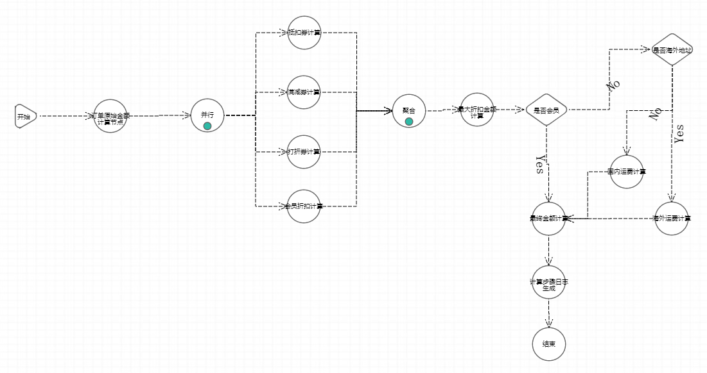
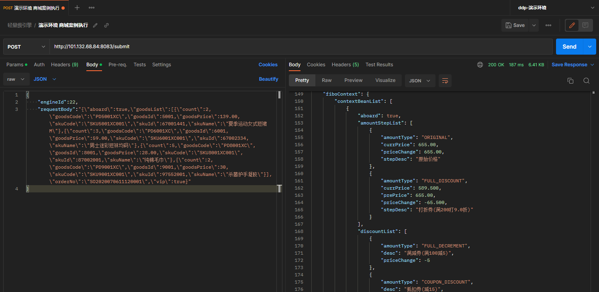

# 电商案例
电商案例是一个订单金额计算案例，模拟了电商系统中对订单金额的计算。<br>
fiborule-test-mall模块
* 1、接收订单数据后，先计算出订单原始金额；
* 2、然后按照原始金额计算出抵扣金额、满减金额、打折券金额、会员折扣金额，取四种优惠的最大金额；
* 3、然后按照是否会员和是否海外地址计算出运费；
* 4、最后得出订单的最终金额。

## 组件开发
- - -
* OrderInitNode - 订单原始金额计算组件
* CouponDiscountNode - 抵扣券计算组件（抵扣金额支持配置）
* FullDecrementNode - 满减券计算组件（满足金额和减免金额支持配置）
* FullDisCountNode - 打折券计算组件（满足金额和折扣支持配置）
* MemberDisCountNode - 会员折扣计算组件（折扣支持配置）
* DisCountCollectNode - 最大折扣金额计算组件
* MemberJudgeNode - 是否会员组件
* AddressJudgeNode - 是否海外地址组件
* HomeFreightNode - 国内运费计算组件（运费和免运费金额支持配置）
* AbroadFreightNode - 海外运费计算组件（运费支持配置）
* FinalAmountNode - 最终金额计算组件
* AmountStepPrintNode - 计算步骤日志生成组件
* PriceContext - 价格计算上下文
* OrderVo - 订单类，引擎执行参数
* SendService - 通知发送模拟类，Spring应用可以直接注入，非Spring应用请初始化FiboBeanUtils的FiboBeanFactory装配实例

## 后台配置
- - -
```Java
fiborule.app=36
fiborule.server=localhost:18121
fiborule.scene-list[0].name=mall-price
fiborule.scene-list[0].path=com.fibo.rule.test.mall
```
## 引擎流程图
- - -


## 引擎编排案例json
- - -
将以下json复制到.json文件中，在服务端引擎编排界面进行导入
```json
[
  {"nodeName":"开始","nodeCode":"start_1","nodeType":1,"preNodes":"","nextNodes":"general_2","nodeX":"-29","nodeY":"-80"},
  {"nodeName":"订单原始金额计算节点","beanName":"订单原始金额计算","nodeCode":"general_2","nodeType":3,"preNodes":"start_1","nextNodes":"parallel_3","nodeConfig":"{}","nodeX":"86","nodeY":"-80","nodeClazz":"com.fibo.rule.test.mall.node.OrderInitNode","clazzName":"OrderInitNode"},
  {"nodeName":"聚合","nodeCode":"aggregation_4","nodeType":7,"preNodes":"general_5,general_6,general_7,general_8","nextNodes":"general_9","nodeX":"464","nodeY":"-88","nodeGroup":"518a8a/1672912234107"},
  {"nodeName":"并行","nodeCode":"parallel_3","nodeType":6,"preNodes":"general_2","nextNodes":"general_5,general_7,general_8","nodeX":"205","nodeY":"-80","nodeGroup":"518a8a/1672912234107"},
  {"nodeName":"抵扣劵计算","beanName":"抵扣券计算","nodeCode":"general_5","nodeType":3,"preNodes":"parallel_3","nextNodes":"aggregation_4","nodeConfig":"{\"couponValue\":15}","nodeX":"347","nodeY":"-194","nodeClazz":"com.fibo.rule.test.mall.node.CouponDiscountNode","clazzName":"CouponDiscountNode"},
  {"nodeName":"满减卷计算","beanName":"满减券计算","nodeCode":"general_6","nodeType":3,"preNodes":"parallel_3","nextNodes":"aggregation_4","nodeConfig":"{\"fullValue\":100,\"decrementValue\":5}","nodeX":"346","nodeY":"-126","nodeClazz":"com.fibo.rule.test.mall.node.FullDecrementNode","clazzName":"FullDecrementNode"},
  {"nodeName":"打折券计算","beanName":"打折券计算","nodeCode":"general_7","nodeType":3,"preNodes":"parallel_3","nextNodes":"aggregation_4","nodeConfig":"{\"fullValue\":200,\"discountValue\":0.9}","nodeX":"346","nodeY":"-57","nodeClazz":"com.fibo.rule.test.mall.node.FullDisCountNode","clazzName":"FullDisCountNode"},
  {"nodeName":"会员折扣计算","beanName":"会员折扣计算","nodeCode":"general_8","nodeType":3,"preNodes":"parallel_3","nextNodes":"aggregation_4","nodeConfig":"{\"discountValue\":0.9}","nodeX":"346","nodeY":"12","nodeClazz":"com.fibo.rule.test.mall.node.MemberDisCountNode","clazzName":"MemberDisCountNode"},
  {"nodeName":"最大折扣金额计算","beanName":"最大折扣金额计算","nodeCode":"general_9","nodeType":3,"preNodes":"aggregation_4","nextNodes":"if_10","nodeConfig":"{}","nodeX":"575","nodeY":"-88","nodeClazz":"com.fibo.rule.test.mall.node.DisCountCollectNode","clazzName":"DisCountCollectNode"},
  {"nodeName":"是否会员","beanName":"是否会员","nodeCode":"if_10","nodeType":4,"preNodes":"general_9","nextNodes":"if_11,general_14","nodeConfig":"{}","nodeX":"676","nodeY":"-88","nodeClazz":"com.fibo.rule.test.mall.node.MemberJudgeNode","clazzName":"MemberJudgeNode","nextNodeValue":"[{\"key\":\"N\",\"label\":\"No\",\"value\":\"if_11\"},{\"key\":\"Y\",\"label\":\"Yes\",\"value\":\"general_14\"}]"},
  {"nodeName":"是否海外地址","beanName":"是否海外地址","nodeCode":"if_11","nodeType":4,"preNodes":"if_10","nextNodes":"general_12,general_13","nodeConfig":"{}","nodeX":"865","nodeY":"-173","nodeClazz":"com.fibo.rule.test.mall.node.AddressJudgeNode","clazzName":"AddressJudgeNode","nextNodeValue":"[{\"key\":\"N\",\"label\":\"No\",\"value\":\"general_12\"},{\"key\":\"Y\",\"label\":\"Yes\",\"value\":\"general_13\"}]"},
  {"nodeName":"国内运费计算","beanName":"国内运费计算","nodeCode":"general_12","nodeType":3,"preNodes":"if_11","nextNodes":"","nodeConfig":"{\"fullValue\":99,\"freightValue\":10}","nodeX":"811","nodeY":"-24","nodeClazz":"com.fibo.rule.test.mall.node.HomeFreightNode","clazzName":"HomeFreightNode"},
  {"nodeName":"海外运费计算","beanName":"海外运费计算","nodeCode":"general_13","nodeType":3,"preNodes":"if_11","nextNodes":"general_14","nodeConfig":"{\"freightValue\":15}","nodeX":"875","nodeY":"59","nodeClazz":"com.fibo.rule.test.mall.node.AbroadFreightNode","clazzName":"AbroadFreightNode"},
  {"nodeName":"最终金额计算","beanName":"最终金额计算","nodeCode":"general_14","nodeType":3,"preNodes":"if_10,general_13","nextNodes":"general_15","nodeConfig":"{}","nodeX":"686","nodeY":"59","nodeClazz":"com.fibo.rule.test.mall.node.FinalAmountNode","clazzName":"FinalAmountNode"},
  {"nodeName":"计算步骤日志生成","beanName":"计算步骤日志生成","nodeCode":"general_15","nodeType":3,"preNodes":"general_14","nextNodes":"end_16","nodeConfig":"{}","nodeX":"686","nodeY":"162","nodeClazz":"com.fibo.rule.test.mall.node.AmountStepPrintNode","clazzName":"AmountStepPrintNode"},
  {"nodeName":"结束","nodeCode":"end_16","nodeType":2,"preNodes":"general_15","nextNodes":"","nodeX":"686","nodeY":"255"}
]
```

##演示环境引擎执行
- - -
执行路径（post）：http://101.132.68.84:8083/submit <br/>
执行参数:
```json
{
  "engineId":22,
  "requestBody":"{\"aboard\":true,\"goodsList\":[{\"count\":2,\"goodsCode\":\"PD5001XC\",\"goodsId\":5001,\"goodsPrice\":139.00,\"skuCode\":\"SKU5001XC001\",\"skuId\":67001441,\"skuName\":\"夏季运动女式短裙M\"},{\"count\":3,\"goodsCode\":\"PD6001XC\",\"goodsId\":6001,\"goodsPrice\":59.00,\"skuCode\":\"SKU6001XC001\",\"skuId\":67002334,\"skuName\":\"男士迷彩短袜均码\"},{\"count\":5,\"goodsCode\":\"PD8001XC\",\"goodsId\":8001,\"goodsPrice\":28.00,\"skuCode\":\"SKU8001XC001\",\"skuId\":87002001,\"skuName\":\"纯棉毛巾\"},{\"count\":2,\"goodsCode\":\"PD9001XC\",\"goodsId\":9001,\"goodsPrice\":30,\"skuCode\":\"SKU9001XC001\",\"skuId\":97552001,\"skuName\":\"杀菌护手凝胶\"}],\"orderNo\":\"SO2020070611120001\",\"vip\":true}"
}
```


## 执行结果
- - -
参数-订单信息json
```json
{
  "aboard":false,
  "orderNo":"SO2020070611120001",
  "vip":false,
  "goodsList":[
    {"count":2,"goodsCode":"PD5001XC","goodsId":5001,"goodsPrice":139.00,"skuCode":"SKU5001XC001","skuId":67001441,"skuName":"夏季运动女式短裙M"},
    {"count":3,"goodsCode":"PD6001XC","goodsId":6001,"goodsPrice":59.00,"skuCode":"SKU6001XC001","skuId":67002334,"skuName":"男士迷彩短袜均码"},
    {"count":5,"goodsCode":"PD8001XC","goodsId":8001,"goodsPrice":28.00,"skuCode":"SKU8001XC001","skuId":87002001,"skuName":"纯棉毛巾"},
    {"count":2,"goodsCode":"PD9001XC","goodsId":9001,"goodsPrice":30,"skuCode":"SKU9001XC001","skuId":97552001,"skuName":"杀菌护手凝胶"}
  ]
}
```
执行结果-价格计算上下文json
```json
{
  "aboard":false,
  "amountStepList":[
    {"amountType":"ORIGINAL","currPrice":655,"priceChange":655,"stepDesc":"原始价格"},
    {"amountType":"FULL_DISCOUNT","currPrice":589.5,"prePrice":655,"priceChange":-65.5,"stepDesc":"打折券(满200打9.0折)"},
    {"amountType":"POSTAGE","currPrice":599.5,"prePrice":589.5,"priceChange":10,"stepDesc":"国内运费"},
    {"amountType":"POSTAGE_FREE","currPrice":589.5,"prePrice":599.5,"priceChange":-10,"stepDesc":"运费减免(满99)"}
  ],
  "discountList":[
    {"amountType":"COUPON_DISCOUNT","desc":"抵扣券(减15)","priceChange":-15},
    {"amountType":"FULL_DECREMENT","desc":"满减券(满100减5)","priceChange":-5},
    {"amountType":"FULL_DISCOUNT", "desc":"打折券(满200打9.0折)", "priceChange":-65.5}
  ],
  "finalPrice":589.5,
  "goodesList":[
    {"count":2,"goodsCode":"PD5001XC","goodsId":5001,"goodsPrice":139.00,"skuCode":"SKU5001XC001","skuId":67001441,"skuName":"夏季运动女式短裙M"},
    {"count":3,"goodsCode":"PD6001XC","goodsId":6001,"goodsPrice":59.00,"skuCode":"SKU6001XC001","skuId":67002334,"skuName":"男士迷彩短袜均码"},
    {"count":5,"goodsCode":"PD8001XC","goodsId":8001,"goodsPrice":28.00,"skuCode":"SKU8001XC001","skuId":87002001,"skuName":"纯棉毛巾"},
    {"count":2,"goodsCode":"PD9001XC","goodsId":9001,"goodsPrice":30,"skuCode":"SKU9001XC001","skuId":97552001,"skuName":"杀菌护手凝胶"}
  ],
  "lastestAmountStep":{
    "$ref":"$.amountStepList[3]"
  },
  "orderNo":"SO2020070611120001",
  "originalPrice":655,
  "printLog":"订单号[SO2020070611120001]的价格计算的明细结果:\n|====================================================================\n|   夏季运动女式短裙M [PD5001XC] [SKU5001XC001]   139.00 X 2\n|   男士迷彩短袜均码 [PD6001XC] [SKU6001XC001]   59.00 X 3\n|   纯棉毛巾 [PD8001XC] [SKU8001XC001]   28.00 X 5\n|   杀菌护手凝胶 [PD9001XC] [SKU9001XC001]   30.00 X 2\n|====================================================================\n|   [原始价格 : 655.00]\n|   [打折券(满200打9.0折) : -65.50]\n|   [国内运费 : 10.00]\n|   [运费减免(满99) : -10.00]\n|   [最终价 : 589.50]\n|====================================================================\n",
  "vip":false
}
```
订单执行结果日志

    订单号[SO2020070611120001]的价格计算的明细结果:
    |====================================================================
    |   夏季运动女式短裙M [PD5001XC] [SKU5001XC001]   139.00 X 2
    |   男士迷彩短袜均码 [PD6001XC] [SKU6001XC001]   59.00 X 3
    |   纯棉毛巾 [PD8001XC] [SKU8001XC001]   28.00 X 5
    |   杀菌护手凝胶 [PD9001XC] [SKU9001XC001]   30.00 X 2
    |====================================================================
    |   [原始价格 : 655.00]
    |   [打折券(满200打9.0折) : -65.50]
    |   [国内运费 : 10.00]
    |   [运费减免(满99) : -10.00]
    |   [最终价 : 589.50]
    |====================================================================
