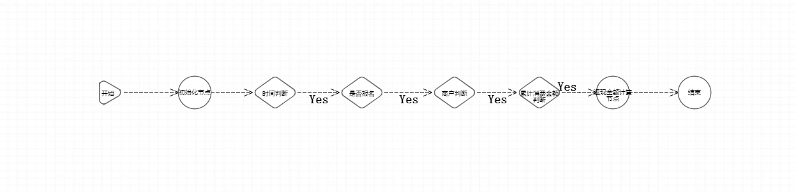

# 营销案例
营销案例是一个根据交易信息计算返现金额的案例。<br>
fiborule-test-market模块
* 1、判断交易时间是否在活动时间范围内；
* 2、判断当前客户是否报名该活动；
* 3、商户限制；
* 4、累计消费金额限制；
* 5、计算返现金额，并限制最大返现金额。

## 组件开发
- - -
* ContextInitNode - 交易信息初始化节点，初始化参数
* DateJudgeNode - 时间判断节点，判断交易时间是否在活动时间范围内
* EnrollJudgeNode - 交易客户是否报名该活动判断
* MerchantJudgeNode - 商户判断，是否为对应的商户
* ConsumeAmountJudgeNode - 累计消费金额判断，可以放在redis中，判断累计金额是否达标，并累加金额
* CashBackNode - 根据返现百分比计算返现金额，并判断限额

## 后台配置
- - -
```Java
fiborule.app=38
fiborule.server=192.168.1.38:18121
fiborule.scene-list[0].name=market
fiborule.scene-list[0].path=com.fibo.rule.test.market
```
## 引擎流程图
- - -

## 执行结果
- - -
参数-订单信息json
```json
{
  "bankTradeCode":"1000561650337995000",
  "cardNumber":"652352******7425",
  "cardProductName":"",
  "cardProductNumber":"",
  "customerNumber":"9888888888",
  "merchantCityCode":"330000",
  "merchantCode":"437034323252737",
  "merchantCountryCode":"103",
  "merchantName":"商户一",
  "tradeAmount":1000,
  "tradeDate":"2023-01-05",
  "tradePlaceCity":"330000",
  "tradePlaceProvince":"156"
}
```
执行结果-价格计算上下文json
```json
{
  "result": {
    "cashBack": {
      "cashBackAmount": 200,
      "cashbackPayType": 1
    },
    "hit": true
  },
  "tradeVo": {
    "bankTradeCode": "1000561650337995000",
    "cardNumber": "652352******7425",
    "cardProductName": "",
    "cardProductNumber": "",
    "customerNumber": "9888888888",
    "localTradeDate": 1672848000000,
    "merchantCityCode": "330000",
    "merchantCode": "437034323252737",
    "merchantCountryCode": "103",
    "merchantName": "商户一",
    "tradeAmount": 1000,
    "tradeDate": "2023-01-05",
    "tradePlaceCity": "330000",
    "tradePlaceProvince": "156"
  }
}
```
## 引擎编排案例json
- - -
将以下json复制到.json文件中，在服务端引擎编排界面进行导入
```json
[
  {"nodeName":"开始","nodeCode":"start_1","nodeType":1,"preNodes":"","nextNodes":"general_2","nodeX":"-23","nodeY":"-95"},
  {"nodeName":"初始化节点","beanName":"初始化节点","nodeCode":"general_2","nodeType":3,"preNodes":"start_1","nextNodes":"if_3","nodeConfig":"{}","nodeX":"113","nodeY":"-95","nodeClazz":"com.fibo.rule.test.market.node.ContextInitNode","clazzName":"ContextInitNode"},
  {"nodeName":"时间判断","beanName":"时间判断节点","nodeCode":"if_3","nodeType":4,"preNodes":"general_2","nextNodes":"if_4","nodeConfig":"{\"startDate\":\"2022-12-31T16:00:00.000Z\",\"endDate\":\"2023-12-30T16:00:00.000Z\"}","nodeX":"229","nodeY":"-95","nodeClazz":"com.fibo.rule.test.market.node.DateJudgeNode","clazzName":"DateJudgeNode","nextNodeValue":"[{\"key\":\"Y\",\"label\":\"Yes\",\"value\":\"if_4\"}]"},
  {"nodeName":"是否报名","beanName":"是否报名节点","nodeCode":"if_4","nodeType":4,"preNodes":"if_3","nextNodes":"if_5","nodeConfig":"{}","nodeX":"365","nodeY":"-95","nodeClazz":"com.fibo.rule.test.market.node.EnrollJudgeNode","clazzName":"EnrollJudgeNode","nextNodeValue":"[{\"key\":\"Y\",\"label\":\"Yes\",\"value\":\"if_5\"}]"},
  {"nodeName":"商户判断","beanName":"指定商户判断节点","nodeCode":"if_5","nodeType":4,"preNodes":"if_4","nextNodes":"if_6","nodeConfig":"{\"merchantCodes\":\"437034323252737\"}","nodeX":"510","nodeY":"-95","nodeClazz":"com.fibo.rule.test.market.node.MerchantJudgeNode","clazzName":"MerchantJudgeNode","nextNodeValue":"[{\"key\":\"Y\",\"label\":\"Yes\",\"value\":\"if_6\"}]"},
  {"nodeName":"累计消费金额判断","beanName":"累计消费金额判断节点","nodeCode":"if_6","nodeType":4,"preNodes":"if_5","nextNodes":"general_7","nodeConfig":"{\"consumeAmount\":6000}","nodeX":"643","nodeY":"-95","nodeClazz":"com.fibo.rule.test.market.node.ConsumeAmountJudgeNode","clazzName":"ConsumeAmountJudgeNode","nextNodeValue":"[{\"key\":\"Y\",\"label\":\"Yes\",\"value\":\"general_7\"}]"},
  {"nodeName":"返现金额计算节点","beanName":"返现金额计算节点","nodeCode":"general_7","nodeType":3,"preNodes":"if_6","nextNodes":"end_8","nodeConfig":"{\"cashBackPercent\":0.9,\"cashBackQuota\":200,\"payType\":1}","nodeX":"768","nodeY":"-95","nodeClazz":"com.fibo.rule.test.market.node.CashBackNode","clazzName":"CashBackNode","nextNodeValue":"[]"},
  {"nodeName":"结束","nodeCode":"end_8","nodeType":2,"preNodes":"general_7","nextNodes":"","nodeX":"896","nodeY":"-95"}
]
```