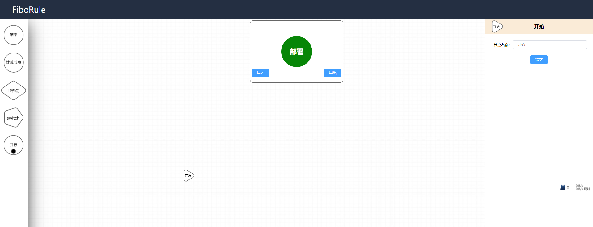

# FiboRule 操作手册

## 1.App列表（首页）

* App是系统最基础的模块，操作引擎之前需要先创建一个App
* 一个App一般可以视作为一个单独的项目或者一个分类
* 将鼠标移动至App图标上可以编辑或者删除App，点击App图标可以进入App查看App下包含的引擎

## 2.引擎列表

* 一个App下可以有多个引擎 ，每个引擎之间互不干涉
* 创建引擎时需要选择场景值，场景值在后端配置文件中配置完成
* 引擎节点中的配置内容是从场景值下的配置项中取出，因此场景值不同节点的可选内容也不同
* 引擎添加成功后场景值禁止修改

## 3.引擎配置（决策流配置）

### （1） 添加节点
* 从左侧节点列表中拉取节点放置在决策流中完成添加节点操作
* 部分需要配置完成后才能连线的节点，在刚添加未配置的状态下会呈红色边框显示 

### （2） 操作节点

* 鼠标移动至节点上时会出现操作框
* 红色 “X” 键为删除节点
### （3） 配置节点

* 点击节点可以打开节点的内部配置
* 实例选择完成后会带出实例下的参数 配置完成参数后即可提交、
### （4） 节点连线

* 灰色 “+” 键按住拖动可以  以此节点为开始节点 进行连线
* 拖出连线后在其他节点上松开即可连线成功
* 连线需要满足以下规则
 1. 不能以“开始节点”结束连线
 2. 不能以“结束节点”开始连线
 3. 连线不能循环
 4. 要保证并行聚合节点的嵌套关系正确
* 红色边框的节点是需要先配置完成后才能连线的节点，需要先进行配置
* if Switch 并行 为 多子节点 可以拉出多个连线
* if 节点的连线模式为 Yes 和 No 表示if节点的判断结果
* Switch 节点的连线模式为Switch的判断结果，根据实例不同，连线模式也会不同

## 4.节点
### （1） 开始节点
* 开始节点无需配置 不能添加 不能删除
* 开始节点会在引擎创建时自动生成
* 引擎运行时是从开始节点开始的
* 不能以开始节点为任何节点的结束节点
### （2）结束节点
* 结束节点无需配置 表示流程的结束
* 不能以结束节点开始连线
### （3）计算节点
* 选择一个实例 根据实例的内容进行计算
### （4）If节点
* 根据实例内容得出一个Yes 或是No 再根据得出的结果决定走哪条连线
### (5) Switch节点
* 根据实例内容得出一个自定义的值,再根据得出的结果决定走哪条连线
### (6)并行节点
* 运行到此节点时,会根据此节点后的连线,同时进行多条路径的计算
### (7)聚合节点
* 在并行同时计算多条路径后,会在此节点进行合并

## 5.引擎部署

* 点击部署按钮即可将当前引擎部署
* 如出现 节点连线循环 并行聚合嵌套出错 则会部署失败
* 引擎部署后才能调用