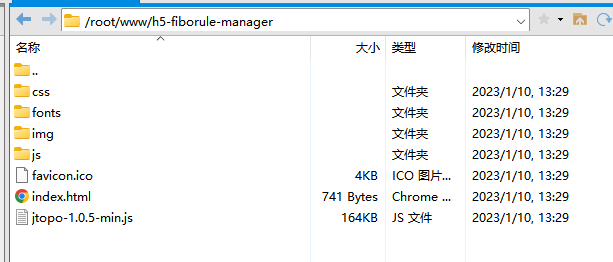
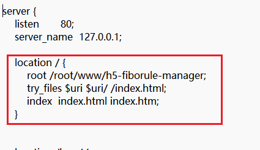

# 后端部署
##server安装
###安装数据库
安装mysql，新建fibo_rule数据库用于存储配置
```
CREATE DATABASE IF NOT EXISTS fibo_rule Character Set utf8mb4;
```
表结构sql地址：
https://github.com/FiboAI/FiboRuleLite/blob/dev_20221123/fiborule/fiborule-server/src/main/resources/doc/rule.sql
```
DROP TABLE IF EXISTS `t_app`;
CREATE TABLE `t_app` (
  `id` bigint(20) NOT NULL AUTO_INCREMENT COMMENT '删除标志：0未删除，1已删除',
  `app_name` varchar(50) DEFAULT NULL COMMENT 'app名称',
  `app_code` varchar(50) DEFAULT NULL COMMENT 'appcode,手动输入',
  `descriptions` varchar(2550) DEFAULT NULL COMMENT '描述',
  `status` int(11) DEFAULT '1' COMMENT '状态：1有效，0无效',
  `create_time` datetime DEFAULT NULL COMMENT '创建时间',
  `create_user` bigint(20) DEFAULT NULL COMMENT '创建用户id',
  `update_time` datetime DEFAULT NULL COMMENT '更新时间',
  `update_user` bigint(20) DEFAULT NULL COMMENT '最新更新用户id',
  `del_flag` int(11) DEFAULT '0' COMMENT '删除标志:0未删除，1删除',
  PRIMARY KEY (`id`)
) ENGINE=InnoDB AUTO_INCREMENT=37 DEFAULT CHARSET=utf8mb4 COMMENT='应用表';

-- ----------------------------
-- Table structure for t_engine
-- ----------------------------
DROP TABLE IF EXISTS `t_engine`;
CREATE TABLE `t_engine` (
  `id` bigint(20) NOT NULL AUTO_INCREMENT,
  `app_id` bigint(20) NOT NULL DEFAULT '0' COMMENT '关联id',
  `engine_name` varchar(50) DEFAULT NULL COMMENT '引擎名称',
  `engine_code` varchar(50) DEFAULT NULL COMMENT '引擎code,手动输入',
  `scene` varchar(255) DEFAULT NULL COMMENT '场景名称',
  `descriptions` varchar(2550) DEFAULT NULL COMMENT '引擎描述',
  `boot_status` int(11) DEFAULT '0' COMMENT '发布状态:0创建，1发布，2取消发布',
  `status` int(11) DEFAULT '1' COMMENT '状态：0无效，1有效',
  `create_time` datetime DEFAULT NULL COMMENT '创建时间',
  `create_user` bigint(20) DEFAULT NULL COMMENT '创建人id',
  `update_time` datetime DEFAULT NULL COMMENT '更新时间',
  `update_user` bigint(20) DEFAULT NULL COMMENT '最新更新人id',
  `del_flag` int(11) DEFAULT '0' COMMENT '删除标志:0未删除，1删除',
  PRIMARY KEY (`id`)
) ENGINE=InnoDB AUTO_INCREMENT=22 DEFAULT CHARSET=utf8mb4 COMMENT='引擎表';

-- ----------------------------
-- Table structure for t_engine_node
-- ----------------------------
DROP TABLE IF EXISTS `t_engine_node`;
CREATE TABLE `t_engine_node` (
  `id` bigint(20) NOT NULL AUTO_INCREMENT COMMENT '节点id',
  `engine_id` bigint(20) NOT NULL COMMENT '关联引擎id',
  `node_name` varchar(50) DEFAULT NULL COMMENT '节点名称（客户输入）',
  `bean_name` varchar(50) DEFAULT NULL COMMENT '组件注解上的名称（不可重复）',
  `node_code` varchar(255) DEFAULT NULL COMMENT '节点编码(自动编码)',
  `node_type` int(11) DEFAULT NULL COMMENT '节点类型：开始节点、结束节点、普通节点、IF节点、switch节点、并行节点、聚合节点',
  `pre_nodes` varchar(50) DEFAULT NULL COMMENT '前置节点，多个节点以逗号分隔',
  `next_nodes` varchar(50) DEFAULT NULL COMMENT '后置节点，多个节点以逗号分隔',
  `node_config` varchar(2550) DEFAULT NULL COMMENT '节点配置信息（json类型，if/switch有lineValue，并行网关有isAny(先不做)，其他节点需设置阈值）',
  `node_x` varchar(25) DEFAULT NULL,
  `node_y` varchar(25) DEFAULT NULL,
  `node_clazz` varchar(255) DEFAULT NULL COMMENT '类全名称，包名+类名',
  `clazz_name` varchar(50) DEFAULT NULL COMMENT '类名称',
  `node_group` varchar(50) DEFAULT NULL COMMENT 'node组',
  `next_node_value` varchar(255) DEFAULT NULL COMMENT '//后续节点对应的分支值-[{"key":"Y",value:"node1"}]',
  `status` int(11) DEFAULT '1' COMMENT '状态：0无效，1有效',
  `create_time` datetime DEFAULT NULL COMMENT '创建时间',
  `create_user` bigint(20) DEFAULT NULL COMMENT '创建人id',
  `update_time` datetime DEFAULT NULL COMMENT '最新更新时间',
  `update_user` bigint(20) DEFAULT NULL COMMENT '最新更新人关联id',
  `del_flag` int(11) DEFAULT '0' COMMENT '删除标志：0为删除，1已删除',
  PRIMARY KEY (`id`)
) ENGINE=InnoDB AUTO_INCREMENT=325 DEFAULT CHARSET=utf8mb4 COMMENT='引擎节点表';
```
### 下载源代码
```
git clone https://github.com/FiboAI/FiboRuleLite.git
cd FiboRuleLite/fiborule
mvn install -DskipTests
java -jar fiborule-server/target/server.jar
```
### 编辑配置文件
application.yml
```
server:
  port: 8080
  servlet:
    context-path: /rule
    
spring:
  profiles:
    active: dev
  
  datasource:
    druid:
      driver-class-name: com.mysql.cj.jdbc.Driver
      initialSize: 20
      minIdle: 20
      maxActive: 100
      maxWait: 60000
      timeBetweenEvictionRunsMillis: 60000
      minEvictableIdleTimeMillis: 300000
      testWhileIdle: true
      testOnBorrow: true
      testOnReturn: false
      poolPreparedStatements: true
      maxOpenPreparedStatements: 20
      validationQuery: SELECT 1
      validation-query-timeout: 500
      filters: stat
  jackson:
    default-property-inclusion: non_null

    #springBoot2.6.9 与swagger2兼容
  mvc:
    pathmatch:
      matching-strategy: ant_path_matcher
```
application-dev.yml
```
spring:
  datasource:
    druid:
      url: jdbc:mysql://127.0.0.1:3306/fibo_rule?autoReconnect=true&useUnicode=true&characterEncoding=UTF-8&zeroDateTimeBehavior=convertToNull&serverTimezone=Asia/Shanghai
      username: username
      password: password
```


### 启动server
```
java -jar fiborule-server/target/server.jar

```

### 打开配置后台
```
http://localhost:8080/rule/
```

## 前端部署

### 1.环境需求
* 下载nodejs 版本12-14 最好为 12.22.7

### 2.下载依赖
* 进入 h5-fiborule-manager 目录下
* cmd执行 
```
npm i
```
 (如果下载失败请切换为淘宝镜像)


### 3.前端启动 （开发模式，本地开发使用 ，仅在本地使用可以无视4 5 6 条）
* 更改 h5-fiborule-manager/baseUrl.js下的个人服务器后端地址
```
switch (process.env.NODE_ENV) {
	case 'development': // 个人服务器后端地址
		proxyObj = {
			'/rule': {
				target: 'http://localhost:8080', // 个人服务器后端地址 - Riskmanage
				changeOrigin: true, // 是否跨域
				pathRewrite: {
					'^/rule': '/rule'
				}
			},
		}
		break
	
}
```
将 http://localhost:8080 改为 后端启动的端口
* cmd 执行
```
npm run serve
```

### 4.文件编译 (将源文件部署至服务器使用)
* cmd执行
```
npm run build
```
* h5-fiborule-manager/dist 下为编译后的文件

### 5.将编译后的文件放置在服务器上的 自定义目录下 （此处以 /root/www/h5-fiborule-manager) 举例


### 6.配置nginx

* 将服务器端口指向指定目录
* 访问配置好的端口即可